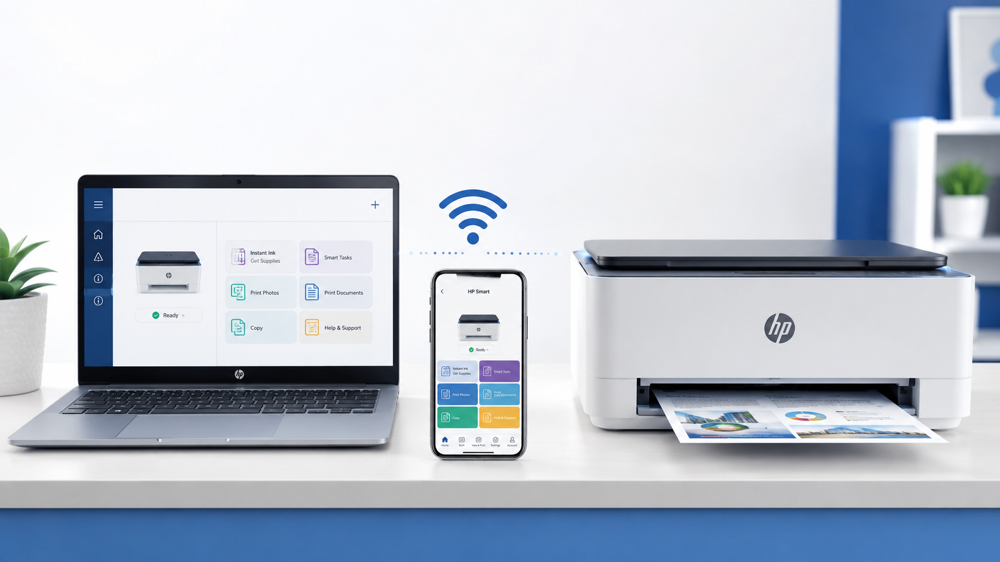

123.hp.com/setup – Download HP Printer Drivers & Complete Setup Guide
=====================================================================

Setting up your HP printer is quick and easy with **123.hp.com/setup**, HP's official printer setup portal. Whether you've purchased a new HP DeskJet, OfficeJet, ENVY, LaserJet, or Smart Tank printer, this page helps you download the latest printer drivers, install HP Smart software, and connect your printer to your Windows PC, Mac, Android phone, or iPhone.

Installing the latest HP software ensures better compatibility with your operating system, improves printer performance, enables wireless printing, and provides access to the newest firmware updates. If your printer isn't printing correctly or you're reinstalling it after replacing your computer, following the proper setup process can help avoid common installation issues.

Download HP Printer Software
----------------------------

To begin setting up your HP printer, visit **123.hp.com/setup** and search for your printer model. The website automatically recommends the latest printer software that matches your operating system.

The downloaded installer includes everything needed to configure your printer, including printer drivers, scanning software, and the HP Smart application.

Using the latest software helps improve compatibility with Windows 11, Windows 10, macOS, Android, and iPhone while reducing installation errors caused by outdated drivers.

Supported HP Printer Series
---------------------------

This guide supports most modern HP printers, including:

* HP DeskJet Series
* HP OfficeJet Series
* HP OfficeJet Pro Series
* HP ENVY Series
* HP LaserJet Series
* HP Color LaserJet Series
* HP Smart Tank Series
* HP Neverstop Laser Series
* HP Ink Tank Printers
* HP DesignJet Printers

Although each printer model may have slightly different menu options, the overall setup process is very similar.

Before You Begin
----------------

Before installing your printer, make sure you have:

* Your HP printer
* Power cable
* Windows PC or Mac
* Stable internet connection
* Printer model number
* Wi-Fi network name
* Wi-Fi password
* Administrator access on your computer

Keeping your printer close to the wireless router during setup helps ensure a stronger signal and smoother installation.

How to Download HP Printer Drivers
----------------------------------

Downloading the correct driver is the most important step of the installation process.

#. Open your preferred web browser.
#. Visit **123.hp.com/setup**.
#. Enter your HP printer model.
#. Select your operating system if prompted.
#. Download the recommended HP software.
#. Wait until the download finishes.

Avoid closing your browser while the software is downloading.

Install HP Printer Software
---------------------------

After downloading the installer, locate the setup file and open it.

The installation wizard automatically guides you through each step. During installation, you'll be asked to accept the license agreement, choose a connection method, and allow the software to detect your printer.

Most installations finish within a few minutes depending on your internet connection and computer performance.

Choose the Right Connection Method
----------------------------------

HP printers generally support several connection options.

Wi-Fi Connection
^^^^^^^^^^^^^^^^

Wireless setup is recommended for most users because it allows multiple computers, smartphones, and tablets to print without using cables.

Benefits include:

* Cable-free printing
* Mobile printing
* Easy printer sharing
* Simple network management

USB Connection
^^^^^^^^^^^^^^

USB installation works well if you only use one computer.

Advantages include:

* Reliable connection
* Fast setup
* No wireless network required
* Stable printing performance

Ethernet Connection
^^^^^^^^^^^^^^^^^^^

Some OfficeJet Pro and LaserJet printers also support Ethernet.

This option is ideal for:

* Offices
* Business environments
* Shared network printers
* High-volume printing

Install HP Smart
----------------

HP Smart is HP's official printer management application.

The application allows you to:

* Print documents
* Print photos
* Scan files
* Save scans as PDF
* Monitor ink levels
* Update printer firmware
* Diagnose printer problems
* Manage multiple HP printers

Installing HP Smart gives you access to the latest printer features and makes printer management much easier.

Benefits of Installing the Latest Driver
----------------------------------------

Keeping your printer software updated provides several advantages.

* Better print quality
* Faster printing
* Improved wireless reliability
* Better scanning performance
* Enhanced security
* Compatibility with Windows and macOS updates
* Bug fixes and performance improvements

Using outdated printer software can lead to printing errors and connection problems.

Install HP Printer on Windows, Mac, Android, and iPhone
-------------------------------------------------------
After downloading the latest printer software from **123.hp.com/setup**, the next step is installing your HP printer and connecting it to your preferred device. HP printers are compatible with Windows, macOS, Android, and iPhone, allowing you to print, scan, and manage documents from almost anywhere.

Although the installation process is simple, following the correct setup method helps prevent common issues such as driver installation failures, printer detection problems, and wireless connection errors.

Install HP Printer on Windows 11
--------------------------------

Windows 11 automatically recognizes many HP printers, but installing the latest HP software unlocks additional features such as HP Smart, wireless scanning, firmware updates, and printer diagnostics.

Before starting the installation:

* Connect the printer to a power source.
* Turn on the printer.
* Install the ink or toner cartridges.
* Load paper into the input tray.
* Wait until the printer finishes initializing.

Once your printer is ready, run the downloaded installer.

The setup wizard will:

* Install the latest HP printer driver.
* Install HP Smart.
* Detect your printer automatically.
* Configure printer settings.
* Complete the installation.

When setup finishes, print a test page to verify that everything is working correctly.

Install HP Printer on Windows 10
--------------------------------

The setup process for Windows 10 is almost identical.

#. Download the latest HP software.
#. Open the installer.
#. Accept the license agreement.
#. Choose your connection method.
#. Wait while Windows installs the printer.
#. Restart the computer if prompted.

Keeping Windows updated helps improve printer compatibility.

Install HP Printer on macOS
---------------------------

HP printers also work seamlessly with macOS.

To install your printer:

#. Turn on the printer.
#. Connect it to your Wi-Fi network.
#. Open the downloaded installer.
#. Complete the installation wizard.
#. Open **System Settings**.
#. Select **Printers & Scanners**.
#. Click **Add Printer**.
#. Choose your HP printer.

macOS automatically downloads additional printer components when required.

Install HP Printer on Android
-----------------------------

Android users can print wirelessly using HP Smart.

After installing HP Smart, simply add your printer and complete the setup.

The application allows you to:

* Print PDF files.
* Print photos.
* Scan documents.
* Monitor printer status.
* Check ink levels.
* Manage printer settings.

As long as your Android phone and printer are connected to the same Wi-Fi network, printing is quick and convenient.

Install HP Printer on iPhone
----------------------------

Many HP printers support Apple AirPrint.

This allows you to print without installing additional printer drivers.

To print from your iPhone:

#. Connect the printer to Wi-Fi.
#. Connect your iPhone to the same network.
#. Open the file or photo.
#. Tap **Share**.
#. Select **Print**.
#. Choose your HP printer.
#. Tap **Print**.

For scanning and printer management, HP Smart provides additional features.

Wireless HP Printer Setup
-------------------------

Wireless printing is the most popular setup method because it allows multiple devices to share one printer.

Most HP printers provide three different wireless setup methods.

Wireless Setup Wizard
^^^^^^^^^^^^^^^^^^^^^

The easiest option is the built-in Wireless Setup Wizard.

Simply:

* Open the printer's Network menu.
* Select **Wireless Setup Wizard**.
* Choose your Wi-Fi network.
* Enter the wireless password.
* Confirm the connection.

After setup completes, the wireless indicator should remain solid.

WPS Setup
^^^^^^^^^

If your wireless router supports WPS:

#. Press the WPS button on the router.
#. Press the printer's Wireless button.
#. Wait for the connection to complete.

This method eliminates the need to manually enter your Wi-Fi password.

HP Smart Wireless Setup
^^^^^^^^^^^^^^^^^^^^^^^

HP Smart provides one of the simplest installation experiences.

Open HP Smart and select **Add Printer**.

The application searches for nearby printers and walks you through each setup step automatically.

USB Printer Installation
------------------------

If you prefer a wired connection, USB installation remains a reliable option.

During installation:

* Start the HP installer.
* Choose **USB Connection**.
* Wait until prompted.
* Connect the USB cable.
* Allow Windows or macOS to detect the printer.
* Finish installation.

Avoid connecting the USB cable before the installer asks you to do so.

Ethernet Setup
--------------

Business printers such as HP OfficeJet Pro and LaserJet often include Ethernet connectivity.

Ethernet offers several advantages:

* Faster communication
* Stable network connection
* Reliable office printing
* Easy printer sharing
* Reduced wireless interference

This connection type is ideal for offices with multiple users.

HP Smart Features
-----------------

HP Smart is more than just printer software.

It helps you:

* Print documents.
* Scan paperwork.
* Save files as PDF.
* Monitor printer health.
* Update firmware.
* Check ink levels.
* Receive printer notifications.
* Manage multiple printers.

Keeping HP Smart updated ensures you always have access to the latest features.

Helpful Installation Tips
-------------------------

Following these recommendations helps ensure a successful setup.

* Download printer software only from **123.hp.com/setup**.
* Use a stable internet connection.
* Keep the printer near the router during wireless setup.
* Install firmware updates regularly.
* Restart your computer after installation.
* Print a test page after setup.
* Use genuine HP ink or toner cartridges.

Troubleshooting Common HP Printer Problems
-------------------------------------------------------
Even after completing the installation through **123.hp.com/setup**, you may occasionally experience issues such as your printer appearing offline, failing to connect to Wi-Fi, or not being detected by your computer. Most of these problems can be resolved by checking your printer settings, updating the latest drivers, and ensuring both your printer and device are connected correctly.

This section explains the most common HP printer issues and the best ways to fix them.

HP Printer Not Detected
-----------------------

If your computer cannot find the printer during installation, try the following solutions.

* Make sure the printer is turned on.
* Verify the printer has finished starting up.
* Restart both the printer and your computer.
* Check that the USB cable is securely connected.
* Ensure both the printer and computer are connected to the same wireless network.

If your printer still doesn't appear, restart the HP installer and allow it to search for available printers again.

HP Printer Offline
------------------

An offline printer usually indicates that your computer cannot communicate with the printer.

To resolve this issue:

* Restart the printer.
* Restart your computer.
* Verify your Wi-Fi connection.
* Remove pending print jobs.
* Set your HP printer as the default printer.
* Reconnect the printer to your wireless network if necessary.

Most offline errors are resolved after reconnecting the printer and restarting both devices.

Wi-Fi Connection Problems
-------------------------

If your HP printer cannot connect to Wi-Fi, check the following:

* Confirm the correct Wi-Fi password.
* Move the printer closer to the router.
* Restart your router.
* Restart the printer.
* Run the Wireless Setup Wizard again.
* Update the printer firmware.

A stable wireless signal helps prevent interrupted printing and scanning.

Printer Driver Installation Failed
----------------------------------

If the software installation stops unexpectedly:

* Restart your computer.
* Delete the previous installer.
* Download the latest installer again.
* Run the installer as Administrator.
* Remove old HP printer software before reinstalling.
* Install the latest Windows or macOS updates.

Using the newest printer software helps avoid compatibility problems.

Poor Print Quality
------------------

If your prints appear faded, blurry, or streaked:

* Check ink or toner levels.
* Clean the printheads.
* Align the printer.
* Use the correct paper type.
* Replace low or empty cartridges.
* Install the latest printer driver.

Regular maintenance helps maintain excellent print quality.

Paper Jam
---------

Paper jams can occur if paper is loaded incorrectly or damaged.

To remove jammed paper safely:

#. Turn off the printer.
#. Disconnect the power cable.
#. Remove any visible paper carefully.
#. Check inside the printer for small paper pieces.
#. Reload paper properly.
#. Restart the printer.

Avoid pulling paper forcefully, as this may damage internal rollers.

Scanner Not Working
-------------------

If your scanner isn't responding:

* Restart the printer.
* Open HP Smart again.
* Update the printer software.
* Check scanner permissions.
* Try scanning using a USB connection.

Most scanner issues are resolved after updating the printer software.

HP Smart App Problems
---------------------

If HP Smart cannot find your printer:

* Restart HP Smart.
* Restart the printer.
* Verify both devices are connected to the same Wi-Fi network.
* Disable VPN temporarily.
* Allow HP Smart through your firewall if required.
* Select **Add Printer** again.

Keeping HP Smart updated improves printer detection and performance.

Maintain Your HP Printer
------------------------

Routine maintenance helps keep your printer working efficiently.

Good maintenance habits include:

* Printing at least once every week.
* Keeping the printer clean.
* Installing firmware updates.
* Replacing cartridges before they become empty.
* Using genuine HP ink or toner.
* Storing paper in a dry place.

These simple practices can extend the life of your printer.

Frequently Asked Questions
--------------------------

What is 123.hp.com/setup?
^^^^^^^^^^^^^^^^^^^^^^^^^

123.hp.com/setup is HP's official setup portal for downloading printer drivers, HP Smart software, and installing supported HP printers.

Is 123.hp.com/setup safe?
^^^^^^^^^^^^^^^^^^^^^^^^^

Yes. It is the official HP website recommended for downloading genuine printer software and updates.

Can I install my HP printer without a CD?
^^^^^^^^^^^^^^^^^^^^^^^^^^^^^^^^^^^^^^^^^

Yes. Most modern HP printers no longer require an installation CD. The latest software can be downloaded online.

Can I print from my smartphone?
^^^^^^^^^^^^^^^^^^^^^^^^^^^^^^^^

Yes. Once your printer is connected to Wi-Fi, you can print from Android and iPhone devices using HP Smart or supported mobile printing features.

Why is my HP printer offline?
^^^^^^^^^^^^^^^^^^^^^^^^^^^^^^

Offline status usually occurs because the printer has lost communication with your computer or wireless network. Restarting both devices and reconnecting the printer often resolves the issue.

How do I update my HP printer driver?
^^^^^^^^^^^^^^^^^^^^^^^^^^^^^^^^^^^^^

Download the latest driver for your printer model and install it over the existing software to improve performance and compatibility.

Can multiple devices use one HP printer?
^^^^^^^^^^^^^^^^^^^^^^^^^^^^^^^^^^^^^^^^^

Yes. After connecting your printer to the same wireless network, multiple computers, smartphones, and tablets can share the printer.

Does HP Smart support scanning?
^^^^^^^^^^^^^^^^^^^^^^^^^^^^^^^^

Yes. HP Smart allows you to scan documents, save files as PDFs, and manage printer settings from one application.

Conclusion
----------

Using **123.hp.com/setup** is the fastest and most reliable way to install your HP printer, download the latest drivers, and configure wireless or USB printing. Whether you're installing a new printer or reconnecting an existing one, following the correct setup process helps ensure smooth printing, scanning, and long-term performance.

Regularly updating your printer software and firmware, maintaining a stable network connection, and using genuine HP supplies can help prevent many common printing issues. If problems occur, the troubleshooting steps in this guide provide practical solutions to get your printer working again quickly.

With the latest HP software installed and your printer configured correctly, you can confidently print documents, scan files, manage printer settings, and enjoy reliable performance across Windows, macOS, Android, and iPhone devices.
